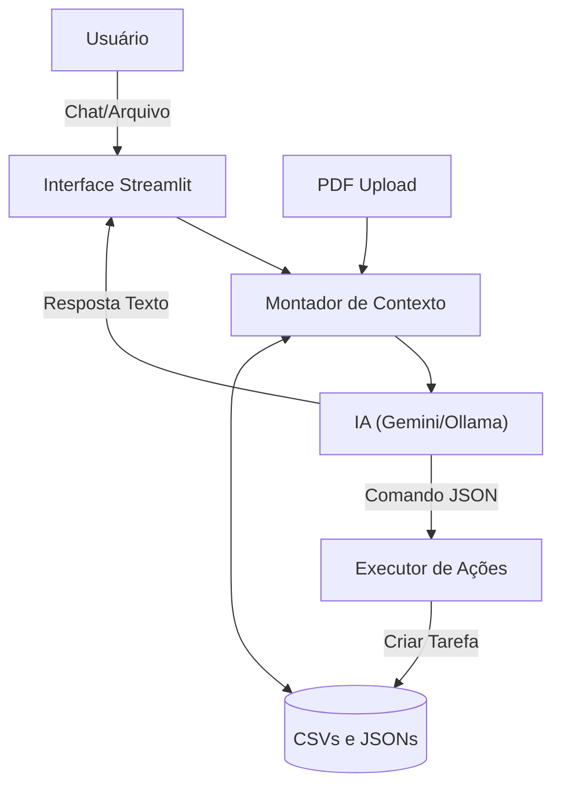

# 🐉 Focus - Agente de Produtividade Pessoal com IA

> Assistente virtual inteligente focado em organização pessoal, integrando tarefas, agenda e análise de documentos.

O **Focus** é um assistente virtual proativo que utiliza Inteligência Artificial para ajudar na organização pessoal, priorização de tarefas e gestão de tempo, integrando dados locais (agenda, tarefas) com análise de documentos (RAG).

---

## 📋 O Problema
Profissionais e estudantes frequentemente sofrem com a sobrecarga de informações, dificuldade em priorizar tarefas e desconexão entre o planejamento (agenda) e a execução (lista de tarefas).

## 💡 A Solução
O Focus atua como um hub central que:
- **Centraliza** tarefas (CSV) e agenda.
- **Analisa** documentos PDF (ex: cronogramas de aulas, boletos) para extrair prazos.
- **Executa** a criação de tarefas via comandos de linguagem natural.
- **Privacidade:** Suporte a execução local (Ollama) ou nuvem (Gemini).

---
## 🏗️ Arquitetura e Tecnologias

O projeto foi construído em Python utilizando Streamlit para interface e Pandas para gestão de dados.

| Componente | Tecnologia | Função |
|------------|------------|--------|
| **Frontend** | [Streamlit](https://streamlit.io/) | Chat interativo e Dashboard de métricas. |
| **IA / LLM** | Google Gemini / Ollama | Cérebro para interpretação de intenções e RAG. |
| **Dados** | Pandas (CSV/JSON) | Banco de dados local para tarefas e rotinas. |
| **Processamento** | PyPDF | Extração de texto de documentos enviados. |

## 🚀 Como Rodar o Projeto

### Pré-requisitos
- Python 3.10 ou superior
- Uma API Key do Google AI Studio (para usar o Gemini) OU Ollama instalado localmente.

### Diagrama de Fluxo

---

### 1. Documentação do Agente

Defina **o que** seu agente faz e **como** ele funciona:

- **Caso de Uso:** Qual problema ele resolve? (ex: consultoria de investimentos, planejamento de metas, alertas de gastos)
- **Persona e Tom de Voz:** Como o agente se comporta e se comunica?
- **Arquitetura:** Fluxo de dados e integração com a base de conhecimento
- **Segurança:** Como evitar alucinações e garantir respostas confiáveis?

📄 **Documentação:** [`docs/01-documentacao-agente.md`](./docs/01-documentacao-agente.md)

---

### 2. Base de Conhecimento

Utilize os **dados mockados** disponíveis na pasta [`data/`](./data/) para alimentar seu agente:

| Arquivo | Formato | Utilização no Agente |
|---------|---------|---------------------|
| `tarefas.csv` | CSV | Leitura e Escrita. Contém ID, título, prazo, prioridade e status. É a única fonte que o agente pode modificar via comandos. |
| `rotinas.json` | JSON | Leitura. Estrutura de hábitos ou blocos de tempo ideais. |
| `preferencias_usuario.json` | JSON | Leitura. Define o nome do usuário e configurações gerais de tratamento. |
| `calendario_eventos.csv` | CSV | Leitura. Compromissos com data e descrição. Usado para detectar conflitos de agenda nos próximos 7 dias. |
| `contexto_trabalho.json` | JSON | Leitura. Informações sobre o ambiente de trabalho e sistemas críticos (foco). |
| `Upload de PDF/TXT` | Memória | RAG Temporário. Conteúdo extraído na hora (via pypdf) para dar contexto sobre documentos específicos durante a sessão. |


📄 **Base:** [`docs/02-base-conhecimento.md`](./docs/02-base-conhecimento.md)

---

### 3. Prompts do Agente

Documente os prompts que definem o comportamento do seu agente:

- **System Prompt:** Instruções gerais de comportamento e restrições
- **Exemplos de Interação:** Cenários de uso com entrada e saída esperada
- **Tratamento de Edge Cases:** Como o agente lida com situações limite

📄 **Prompt:** [`docs/03-prompts.md`](./docs/03-prompts.md)

---

### 4. Aplicação Funcional

Desenvolva um **protótipo funcional** do seu agente:

- Chatbot interativo (sugestão: Streamlit, Gradio ou similar)
- Integração com LLM (via API ou modelo local)
- Conexão com a base de conhecimento

📁 **Pasta:** [`src/`](./src/)

---

### 5. Avaliação e Métricas


**Métricas Sugeridas:**
- Precisão/assertividade das respostas
- Taxa de respostas seguras (sem alucinações)
- Coerência com o perfil do cliente

📄 **Template:** [`docs/04-metricas.md`](./docs/04-metricas.md)
📁 **Uso da API:** [`docs/`](./docs/Uso_da_API.pdf)
📁 **Teste do Agente:** [`docs/`](./docs/Testes_do_agente_Focus.pdf)

---

### 6. Pitch

- Qual problema seu agente resolve?
- Como ele funciona na prática?
- Por que essa solução é inovadora?

📄 **Pitch:** [`docs/05-pitch.md`](./docs/05-pitch.md)

---

## Estrutura do Repositório

```
📁 focus-agente-produtividade/
│
├── 📄 README.md                      # Documentação principal
│
├── 📁 data/                          # Dados mockados para o agente
│   ├── tarefas.csv                   # Banco de tarefas (Leitura/Escrita)
│   ├── calendario_eventos.csv        # Agenda de compromissos (Leitura)
│   ├── rotinas.json                  # Blocos de rotina diária
│   ├── contexto_trabalho.json        # Dados do ambiente profissional
│   └── preferencias_usuario.json     # Configurações de perfil
|
├── 📁 logs/                          # Dados de LOGs
│   ├── focus.log                     # Log de eventos
|
├── 📁 docs/                          # Documentação do projeto
│   ├── 01-documentacao-agente.md     # Caso de uso e arquitetura
│   ├── 02-base-conhecimento.md       # Estratégia de dados
│   ├── 03-prompts.md                 # Engenharia de prompts
│   ├── 04-metricas.md                # Avaliação e métricas
│   └── 05-pitch.md                   # Roteiro do pitch
│
├── 📁 src/                           # Código da aplicação
│   ├── app.py                        # Interface (Streamlit) e orquestração
│   ├── agente.py                     # Lógica do agente (dados, prompt, LLM, comandos)
|   ├── config.py                     # Configuração (paths, API key, logger)
|   └── requirements.txt              # Dependências
│
├── 📁 assets/                        # Imagens e diagramas
│   └── ...
│
└── 📁 examples/                      # Referências e exemplos
    └── README.md
```

---
