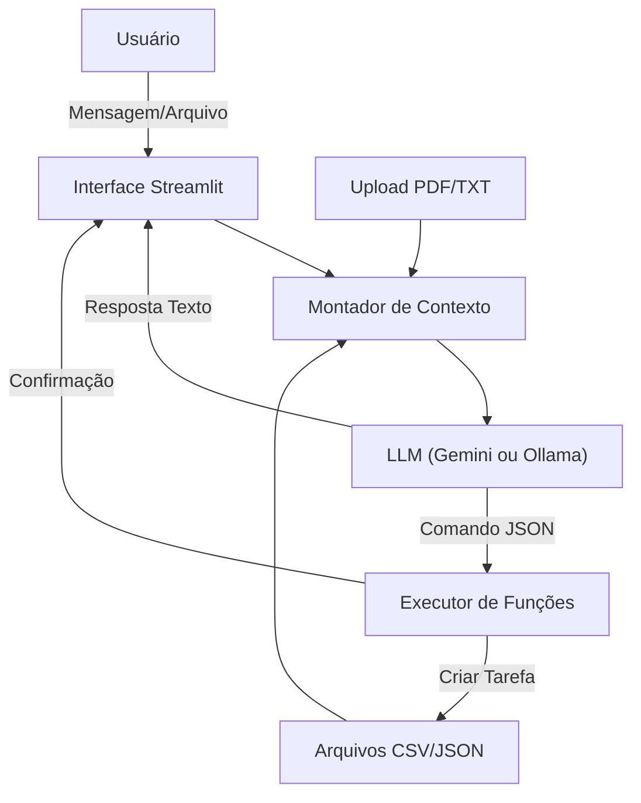

# Documentação do Agente

## Caso de Uso

### Problema
> Qual problema de tempo seu agente resolve?

Profissionais e estudantes lidam com dados dispersos (arquivos, calendários, listas de tarefas) e sofrem com a desconexão entre o planejamento e a execução. A falta de uma visão centralizada que una o contexto pessoal (rotinas, preferências) com a capacidade de raciocínio lógico gera ineficiência e perda de prazos.

### Solução
> Como o agente resolve esse problema de forma proativa?

O Focus atua como um hub central de produtividade. Ele ingere dados locais (CSV de tarefas e agenda), documentos de apoio (PDFs) e preferências pessoais para fornecer orientações contextualizadas. De forma proativa e prática, o agente não apenas sugere, mas pode executar ações de organização (como criar novas tarefas no banco de dados) mediante comando, além de gerar métricas visuais de progresso em tempo real.

### Público-Alvo
> Quem vai usar esse agente?

- Usuários que buscam privacidade (suporte a execução local via Ollama).
- Pessoas que precisam de análise de documentos (PDFs) integrada ao planejamento diário.
- Profissionais que utilizam metodologias de foco e priorização.
- Desenvolvedores ou entusiastas de tecnologia que querem controle sobre seus dados.
- 
---

## Persona e Tom de Voz

### Nome do Agente
Focus

### Personalidade
> Como o agente se comporta? (ex: consultivo, direto, educativo)

Direto, positivo, acolhedor e focado em ação. O agente evita divagações, priorizando respostas curtas e acionáveis ("Action-oriented"). Ele atua como um facilitador que tem "memória" dos documentos e compromissos do usuário.

### Tom de Comunicação
> Formal, informal, técnico, acessível?

Prático e estruturado. O tom é de parceria, focado na resolução imediata de pendências.

### Exemplos de Linguagem
- Saudação: "Com base nas suas tarefas e agenda de hoje, posso sugerir até 5 atividades prioritárias."
- Ação: "✅ Tarefa Criada: Relatório Mensal (Prazo: Amanhã)"
- Correção: "Vamos simplificar. Posso sugerir passos de 25 minutos para facilitar."

---

## Arquitetura

### Diagrama

### Componentes

| Componente | Descrição |
|------------|-----------|
| Interface | Dashboard Streamlit com abas para Chat, Métricas e Documentos. |
| LLM | Híbrido: Suporta Google Gemini (Nuvem) ou Ollama (Local) para inferência. |
| Base de Conhecimento | Injetor de dados que lê CSVs (Tarefas/Agenda), JSONs (Rotinas) e PDFs em tempo real. |
| Validação | Interpretador Python que detecta saídas JSON da IA para criar registros no banco de dados (CSV). |

---

## Segurança e Anti-Alucinação

### Estratégias Adotadas

- [ ] Grounding Rigoroso: O System Prompt força o agente a usar apenas dados fornecidos no contexto (CSV, JSON, PDF)
- [ ] Privacidade de Dados: Opção de rodar modelos localmente (Ollama), mantendo dados sensíveis fora da nuvem.
- [ ] Sanitização de Ações: O interpretador de comandos (JSON) possui tratamento de erros para evitar corrupção dos arquivos CSV.
- [ ] Gestão de Segredos: Chaves de API (Gemini) são gerenciadas via st.secrets ou input protegido, não hardcoded.

### Limitações Declaradas
> O que o agente NÃO faz?

Este agente não acessa APIs externas de calendário (Google Calendar/Outlook) em tempo real (lê apenas o CSV local). Ele não envia e-mails ou notificações fora da aplicação. O agente depende que o usuário mantenha os arquivos de dados (./data/) íntegros para funcionar corretamente.
